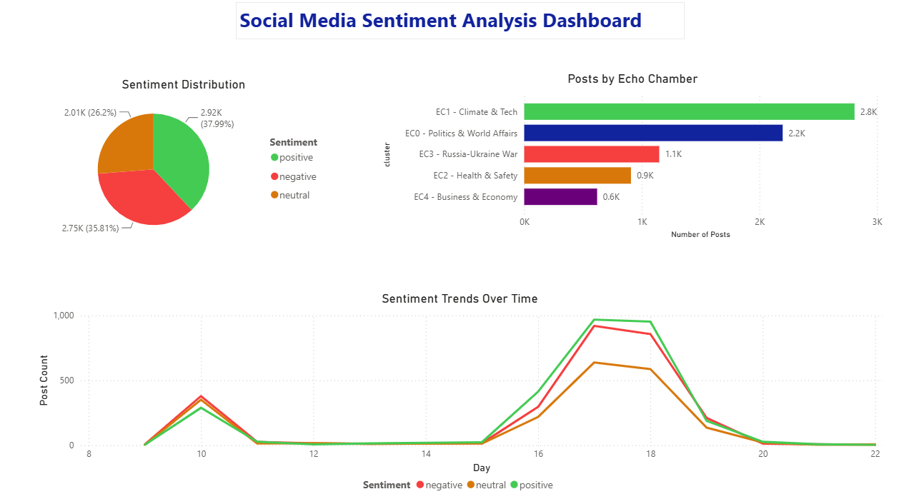
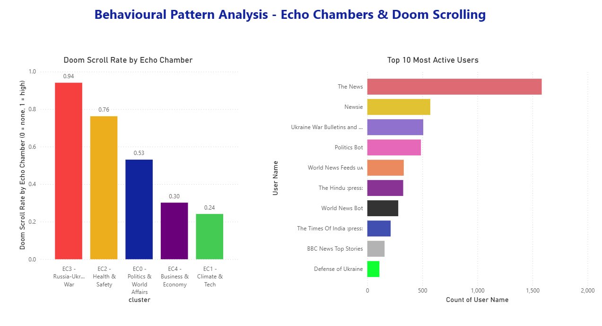

# Social Media Sentiment & Behavioural Pattern Analysis

A Python tool that collects live Mastodon posts, runs sentiment analysis, detects echo chambers, and flags doom-scrolling content. Results are visualised in a Power BI dashboard.

**Dataset:** 7,683 posts collected via Mastodon API  
**Tools:** Python, NLTK, VADER, Pandas, Power BI  
**Type:** End-to-end NLP pipeline with tkinter GUI

---

## What I Built

A 3-step desktop application:

**Step 1: Data Collection**  
Connects to Mastodon API. Pulls 100 posts every 2 minutes. Saves to CSV automatically.

**Step 2: Preprocessing**  
Cleans raw HTML posts through 11 steps: HTML removal, tokenisation, lemmatisation, stopword removal, negation handling, language filtering, and deduplication. VADER assigns sentiment to each post.

**Step 3: Analysis**  
Assigns posts to 5 echo chambers using keyword rules. Flags doom-scrolling content based on negative sentiment and harmful keywords. Outputs enriched CSV for Power BI.

---

## Key Results

| Finding | Value |
|---|---|
| Total posts analysed | 7,683 |
| Positive sentiment | 38% |
| Negative sentiment | 35.8% |
| Neutral sentiment | 26.2% |
| Overall doom-scroll rate | 49.5% |
| Echo chambers detected | 5 |

---

## Echo Chambers Found

| Echo Chamber | Posts | Doom Scroll Rate |
|---|---|---|
| EC3: Russia-Ukraine War | 1,148 | 94% |
| EC2: Health & Safety | 908 | 76% |
| EC0: Politics & World Affairs | 2,198 | 53% |
| EC4: Business & Economy | 620 | 30% |
| EC1: Climate & Tech | 2,809 | 24% |

Russia-Ukraine War had the highest doom-scroll rate at 94%. Nearly every post in that chamber was flagged as harmful content. Health & Safety came second at 76%. Climate & Tech had the lowest at 24%, mostly positive and neutral posts.

---

## Doom Scrolling Analysis

Doom scrolling was detected using two conditions:
- Negative VADER sentiment score
- Presence of harmful keywords: war, death, crisis, attack, disaster, violence, terror, killed, shooting, flood

3,800 out of 7,683 posts were flagged as doom-scrolling content. The Russia-Ukraine and Health & Safety echo chambers drove the majority of this.

---

## Power BI Dashboard

Two pages built in Power BI using the enriched dataset.

**Page 1: Overview**
- Sentiment distribution across all posts
- Post volume by echo chamber
- Sentiment trends over time by day

**Page 2: Behavioural Analysis**
- Doom scroll rate per echo chamber
- Top 10 most active users




---

## How to Run

```bash
pip install -r requirements.txt
```

Create a `.env` file:

Run the app:

```bash
python Scripts/user_interface.py
```

---

## Project Structure

```
├── Mastodon dataset/
├── Pre Processed Dataset/
├── Output/
│   ├── powerbi_ready.csv
│   └── Social_Media_Sentiment_Analysis.pbix
├── Screenshots/
├── Scripts/
│   ├── user_interface.py
│   ├── data_access_layer.py
│   ├── data_collection.py
│   ├── data_pre_processing.py
│   └── methodology.py
├── requirements.txt
└── README.md
```
---

## Related

Based on MSc dissertation at University of Strathclyde, 2023-2024.  
Thesis repo: https://github.com/nverma005/Social-Media-Sentiment-Behavioural-Pattern-Analysis